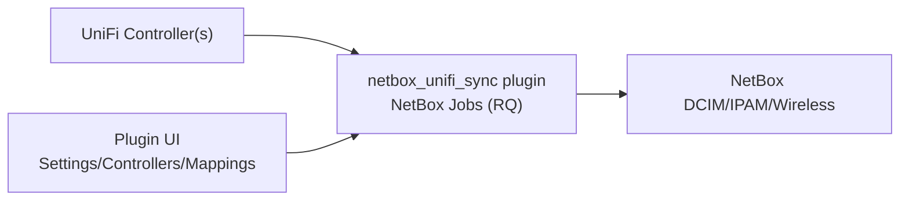
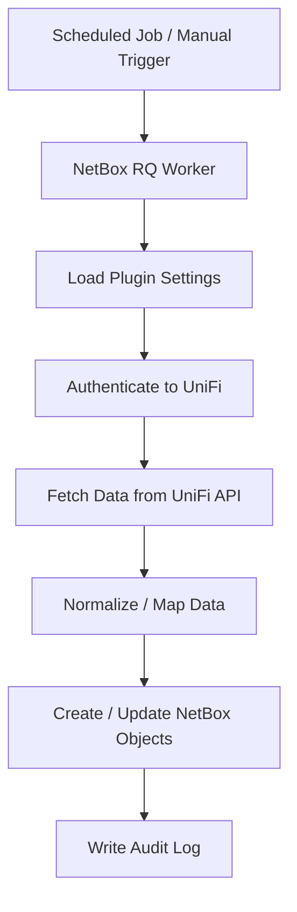
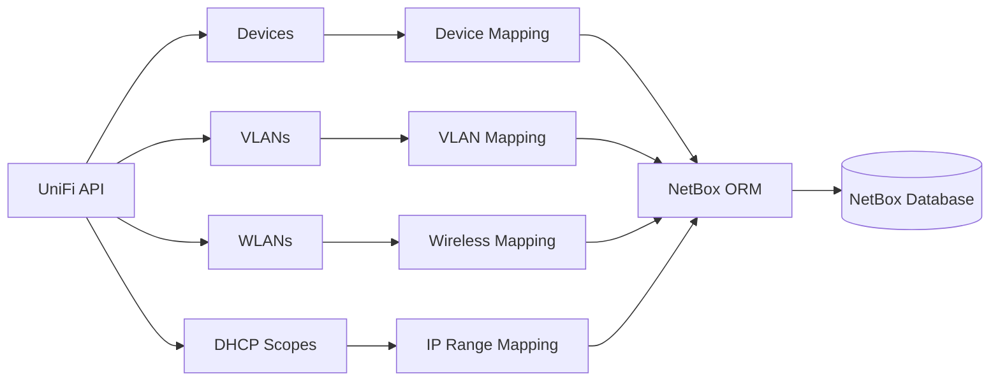
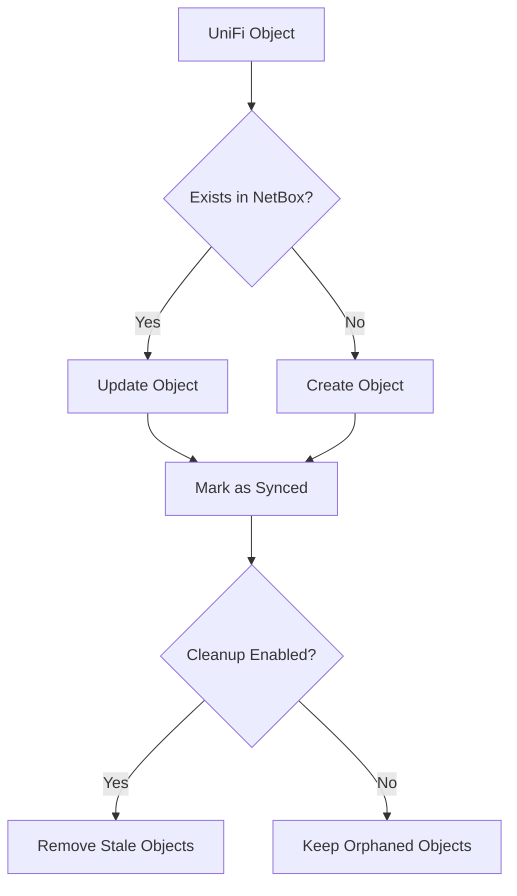
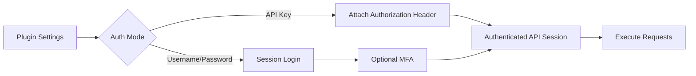
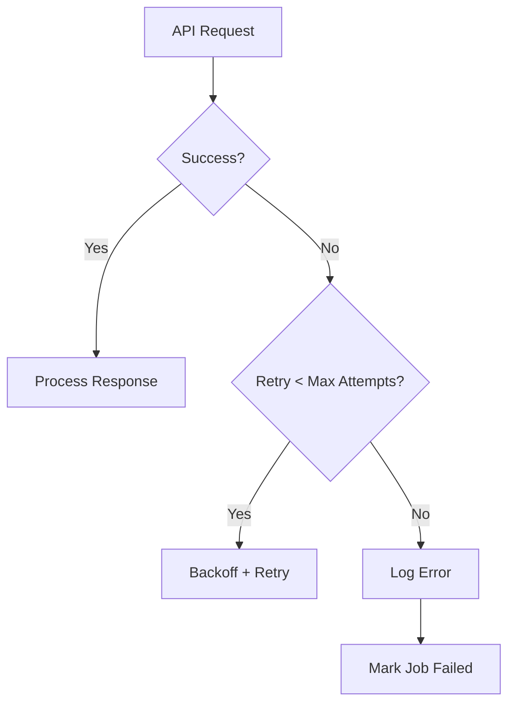

# netbox-unifi-sync

> [!WARNING]
> We are aware that there are issues in the codebase.
> This is a hobby project maintained in spare time.
> Fixes and improvements are implemented when time allows.
> Do not deploy in production without proper validation.

`netbox_unifi_sync` is a NetBox 4.2+ plugin that runs UniFi -> NetBox sync jobs inside NetBox workers.

---

> [!IMPORTANT]
> NetBox should be treated as the Source of Truth.
> Objects created or managed by this plugin should not be manually modified unless you understand how future sync runs will affect them.

---

## Visual Overview




---

## Architecture & Internal Flow

### Runtime Execution Flow



---

### Detailed Sync Pipeline



---

### Object Lifecycle Logic



---

### Authentication Flow



---

### Error Handling & Retry Logic



---

## Features

- Device sync (devices, interfaces, VLANs, prefixes, WLANs, uplink relations, IP assignments)
- **Security Appliance sync** — VLAN subinterfaces and gateway IPs created correctly, including Integration API controllers
- **MAC address sync** — per-port MACs (Legacy API) or device base MAC on Port 1 (Integration API); NetBox 4.5 `MACAddress` model compatible
- DHCP scope sync to NetBox IP Ranges
- Client IP sync to NetBox IPAM with `unifi-client` tagging, stable MAC markers, descriptions, and interface assignment by MAC when NetBox has a matching DCIM or virtualization interface
- NetBox Change Log support for global settings, controllers, and site mappings
- UniFi auth via API key or legacy login (username/password + optional MFA)
- Manual and scheduled sync jobs
- Runtime settings stored in plugin models (`Settings`, `Controllers`, `Site mappings`)

> [!NOTE]
> Normal sync direction is UniFi -> NetBox. DHCP-to-static writeback is the only
> UniFi write path, and it runs only when `dhcp_writeback_enabled` is explicitly enabled.

---

## Quick Start

### 1. Install

```bash
pip install netbox-unifi-sync
```

PyPI project page:
https://pypi.org/project/netbox-unifi-sync/

For `netbox-docker`, add the package to `local_requirements.txt` before build:

```bash
echo "netbox-unifi-sync" >> local_requirements.txt
```

> [!IMPORTANT]
> The plugin must be installed in the same environment as both NetBox and the worker container.
> Otherwise scheduled jobs will fail.

---

### 2. Enable plugin in NetBox

```python
PLUGINS = ["netbox_unifi_sync"]

PLUGINS_CONFIG = {
    "netbox_unifi_sync": {}
}
```

---

### 3. Apply migrations

```bash
python manage.py migrate
```

> [!CAUTION]
> Skipping migrations will result in database errors and plugin initialization failure.

---

### 4. Configure in UI

Go to:

Plugins -> UniFi Sync

Configure:

1. Settings (`tenant_name`, `netbox_roles`, defaults)
2. Controllers (URL, auth mode, credentials)
3. Site mappings (if UniFi/NetBox site names differ)

> [!TIP]
> Use a dedicated read-only API account in UniFi for synchronization.
> This limits impact if credentials are exposed.

---

### 5. Run first sync

UI:
Plugins -> UniFi Sync -> Dashboard -> Run sync

CLI:

```bash
python manage.py netbox_unifi_sync_run --dry-run --json
python manage.py netbox_unifi_sync_run
python manage.py netbox_unifi_sync_run --cleanup
```

> [!IMPORTANT]
> Always run the first execution with --dry-run to verify intended changes before writing to NetBox.

> [!CAUTION]
> The --cleanup flag removes objects in NetBox that no longer exist in UniFi.
> Review carefully before using in production.

---

## Credentials

Set credentials only in:

Plugins -> UniFi Sync -> Controllers

> [!WARNING]
> Never store UniFi credentials in PLUGINS_CONFIG.
> Configuration files may end up in version control or logs.

---

## Scheduled Jobs

The plugin supports NetBox Scheduled Jobs.

Recommended intervals:

- Small environments: every 30–60 minutes
- Larger environments: every 2–4 hours

> [!NOTE]
> High sync frequency increases load on both the UniFi controller and NetBox worker processes.

---

## NetBox Permissions

For normal NetBox users, grant permissions through NetBox object permissions:

- View dashboard/run history: `view` on `netbox_unifi_sync.SyncRun`
- Queue a manual sync job: `add` on `netbox_unifi_sync.SyncRun`
- Manage controllers: `view/add/change/delete` on `netbox_unifi_sync.UnifiController`
- Test controller connectivity: `change` on `netbox_unifi_sync.UnifiController`
- Manage site mappings: `view/add/change/delete` on `netbox_unifi_sync.SiteMapping`
- Manage global settings: `view/change` on `netbox_unifi_sync.GlobalSyncSettings`
- View audit log: `view` on `netbox_unifi_sync.PluginAuditEvent`

The custom permission `netbox_unifi_sync.run_sync` authorises queuing a sync; for
compatibility the view also accepts `netbox_unifi_sync.add_syncrun`. The custom
permission `netbox_unifi_sync.test_controller` authorises the connection test;
`netbox_unifi_sync.change_unificontroller` is also accepted.

Permissions are enforced **twice**: server-side, every write view is guarded with
`permission_required` (a user without the permission gets HTTP 403); and in the UI,
every action button (run sync, add/edit/delete/test controllers and mappings, edit
settings, change log) is hidden unless the user holds the matching object
permission. A view-only user therefore sees status, history and logs but no
mutating controls.

---

## Security Notes

- SSL verification defaults to true
- Secrets are redacted in run history and audit logs
- Timeouts, retries, and backoff are configurable

> [!IMPORTANT]
> If disabling SSL verification for testing, restrict access to the controller network.
> Never disable SSL verification in production environments.

---

## Documentation

- [Server install guide](docs/server-install.md)
- [NetBox plugin mode](docs/netbox-plugin.md)
- [User interface guide](docs/ui.md)
- [Configuration reference](docs/configuration.md)
- [Troubleshooting](docs/troubleshooting.md)
- [Release and PyPI publish](docs/release.md)
- [netbox-docker setup](deploy/netbox-docker/README.md)
- [Wiki source pages](wiki/Home.md)
- [GitHub Wiki](https://github.com/unifi2netbox/netbox-unifi-sync/wiki)

---

## Maintainer: Release to PyPI

1. Bump version in:
   - pyproject.toml (`[project].version`)
   - netbox_unifi_sync/version.py (`__version__`)
   - netbox-plugin.yaml (`compatibility[].release`)
2. Configure PyPI Trusted Publisher (OIDC) for this repository/workflow.
3. Create tag `vX.Y.Z` either:
   - via GitHub Actions `Create Release Tag (manual)` (recommended), or
   - manually with git:
   - `git tag -a vX.Y.Z -m "Release vX.Y.Z"`
   - `git push origin vX.Y.Z`
4. `release.yml` runs on the tag push, gates on lint/tests, and creates the GitHub Release.
5. `publish-python-package.yml` runs on `release: published` and publishes to PyPI (can also be run manually for retry).

> [!NOTE]
> GitHub releases created by `release.yml` use `GITHUB_TOKEN`. If GitHub does not
> emit a follow-up `release: published` workflow event, run **Publish Python Package**
> manually from Actions with the same tag.

> [!CAUTION]
> Version mismatch between pyproject.toml, version.py, and netbox-plugin.yaml will break the release pipeline.
